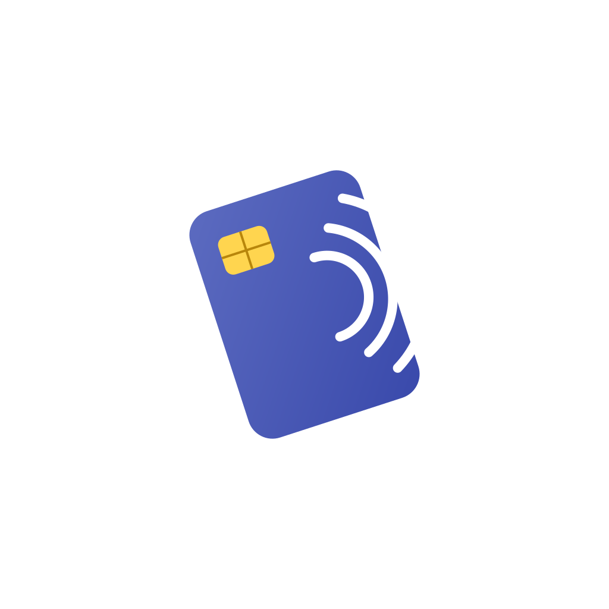
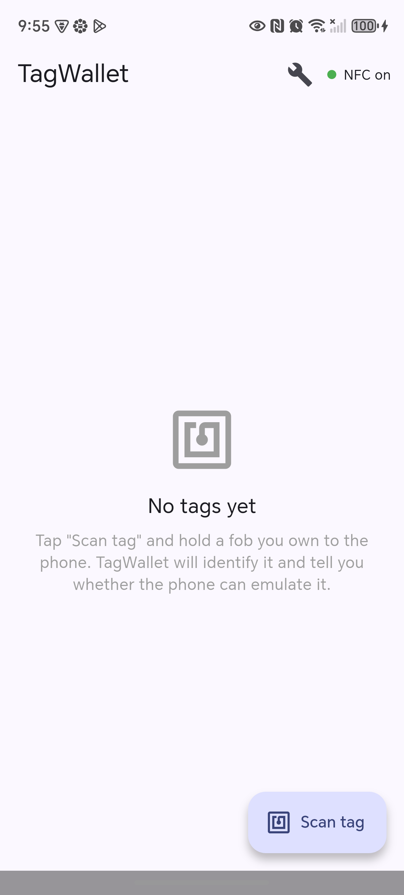

<div align="center">



# TagWallet

**An honest NFC tag wallet for Android — identify, read, dump, and emulate the tags your phone can actually handle.**

[](https://flutter.dev)
[](#requirements)
[](LICENSE)

</div>

---

## Overview

TagWallet is a Flutter app that scans 13.56&nbsp;MHz NFC tags, classifies them, and tells you **honestly** what your phone can do with each one — then does exactly that. No false promises: where the hardware can't help, the app says so and gives you an export path to a device that can.

It was built as a focused, transparent alternative to "clone any card" apps that over-promise. Every capability here maps to something Android's NFC stack genuinely supports.

> **⚠️ Use responsibly.** Only scan, dump, or emulate tags **you own or are explicitly authorized to use**. Bypassing access control you don't own is illegal. This project is for learning, personal tag management, and authorized security testing.

## Features

| Capability | What it does | Hardware reality |
|---|---|---|
| 🔍 **Identify & classify** | Reads any 13.56&nbsp;MHz tag; reports type, UID, ATQA/SAK, NDEF, and a clear verdict | Works for all HF tags |
| 🟢 **ISO-DEP / Type-4 emulation** | Host Card Emulation (HCE) responds to a reader's APDU `SELECT` for a stored AID | The one emulation path Android exposes |
| 📇 **NDEF read / write / clone** | Decode NDEF records; clone them onto a blank NTAG you own | Fully supported |
| 🧩 **MIFARE Classic dump** | Authenticates sectors with common default keys and dumps readable blocks | Read-only (phones can't emulate Classic) |
| 📤 **Export** | Save dumps as **Flipper `.nfc`** or **Proxmark hex** for hardware that can emulate them | Bridges the phone's gaps |
| 💾 **Local wallet** | Saved tags persisted on-device (JSON store), with one-tap emulate toggle | — |

### The honest capability matrix

A phone's NFC chip is a **13.56&nbsp;MHz** radio, and Android only exposes **ISO-DEP** to Host Card Emulation. That defines what's possible:

| Tag / operation | Phone (this app) | Needs external hardware |
|---|:---:|:---:|
| ISO-DEP / Type-4 emulate | ✅ | |
| NDEF read / write / clone | ✅ | |
| MIFARE Classic **read / dump** | ✅ | |
| MIFARE Classic **emulate** | ❌ | Flipper Zero / Proxmark3 |
| 125&nbsp;kHz (EM4100 / HID Prox) | ❌ *(no radio)* | Flipper Zero / Proxmark3 |
| Chosen-UID emulation | ❌ | Proxmark3 + "magic" card |

The intended workflow for anything the phone can't emulate: **phone reads & dumps → export → emulate on a Flipper/Proxmark.**

## Screenshots

<div align="center">

</div>

## Architecture

```
lib/
├── main.dart          UI — wallet list, scan flow, Tools sheet, emulate toggle
├── nfc_service.dart   Tag read/classify + MIFARE/NDEF sessions + HCE platform channel
├── tag_model.dart     SavedTag model + EmulateVerdict classification
├── tag_store.dart     JSON-file-backed local persistence
├── mifare_dump.dart   MIFARE Classic dumper (default-key auth, sector/block read)
├── ndef_ops.dart      NDEF read / write / clone
└── exporters.dart     Flipper .nfc and Proxmark hex exporters

android/app/src/main/kotlin/com/example/tagwallet/
├── MainActivity.kt        MethodChannel: nfcStatus / setActiveTag / clearActiveTag
└── TagHostApduService.kt  HostApduService — serves APDU SELECT responses for the active tag
```

**Emulation path.** Flutter writes the active tag's AID + response into `SharedPreferences` via a `MethodChannel`. The native `TagHostApduService` (an Android `HostApduService`) answers a reader's ISO&nbsp;7816-4 `SELECT` for that AID with the configured payload + `90 00`. AID routing is declared in [`res/xml/apduservice.xml`](android/app/src/main/res/xml/apduservice.xml) using a proprietary `F0…` AID so it never collides with real payment/transit applets.

## Requirements

- **Flutter** 3.41+ / Dart 3.x
- **Android** device with NFC (HCE requires Android 4.4+/API 19; project targets modern SDKs)
- NFC enabled in system settings

## Getting started

```bash
git clone git@github.com:amolood/tagwallet.git
cd tagwallet
flutter pub get
flutter run            # on a connected Android device
```

Build a release APK (also removes the system "debug" overlay):

```bash
flutter build apk --release
# output: build/app/outputs/flutter-apk/app-release.apk
```

### Regenerating branding

The launcher icon and splash are generated from sources in [`assets/branding/`](assets/branding/):

```bash
dart run flutter_launcher_icons        # adaptive icon (white bg + contactless-card mark)
dart run flutter_native_splash:create  # splash screen
```

## Tech stack

- [`flutter_nfc_kit`](https://pub.dev/packages/flutter_nfc_kit) — tag polling, transceive, MIFARE auth/read, NDEF
- [`ndef`](https://pub.dev/packages/ndef) — NDEF record encode/decode
- [`share_plus`](https://pub.dev/packages/share_plus) — exporting dump files
- [`path_provider`](https://pub.dev/packages/path_provider) — local storage location
- Native Kotlin `HostApduService` for HCE

## Roadmap

- [ ] NDEF text/URI quick-write presets
- [ ] Per-tag detail screen with raw dump viewer
- [ ] Import Flipper `.nfc` / Proxmark dumps back into the wallet
- [ ] iOS read-only support (CoreNFC — no HCE on iOS)

## Disclaimer

TagWallet is provided for educational use, personal tag management, and **authorized** security testing only. The authors are not responsible for misuse. Cloning or emulating access credentials you do not own may be illegal in your jurisdiction.

## License

[MIT](LICENSE) © 2026 ABDALRAHMAN MOLOOD
